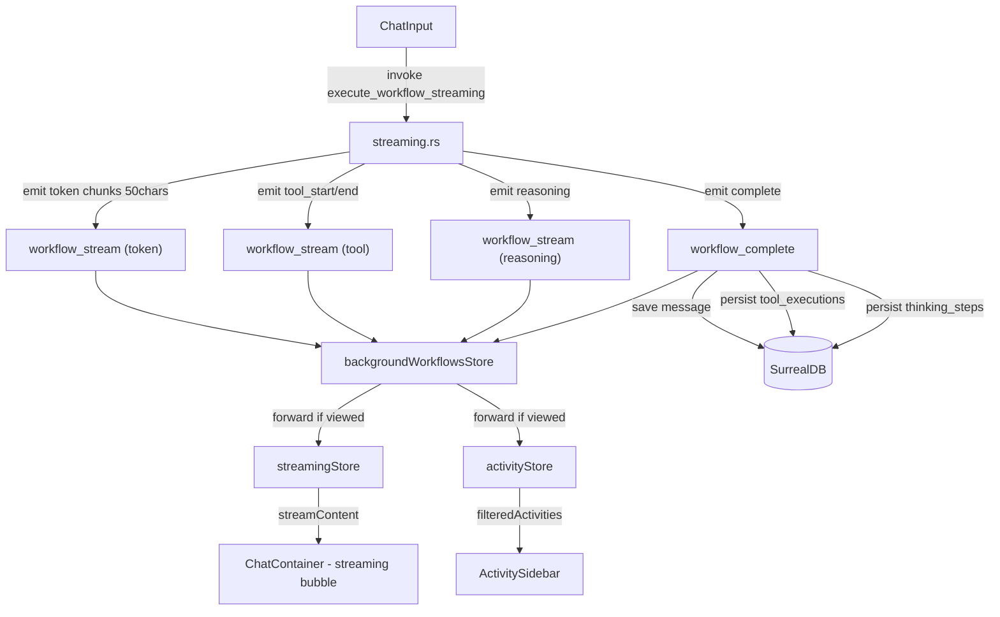
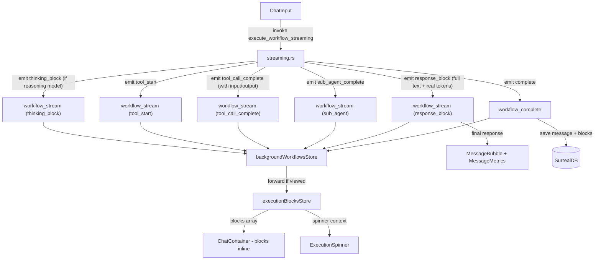

# SA-019: Agent Chat Refactoring - Block-by-Block sans Streaming

## Metadata
- **Date**: 2026-02-23
- **Branche**: `security/audit-remediation-tdd`
- **Complexite**: critical
- **Stack**: Svelte 5.49 + Rust 1.93 + Tauri 2 + SurrealDB 2.5
- **Statut**: P6 DONE (ALL PHASES COMPLETE)

## Contexte

### Demande
Refactorer la page agent pour supprimer le fake streaming, afficher les messages block-by-block avec le thinking des modeles de raisonnement, utiliser les vrais tokens de l'API, et supprimer le sidebar activity.

### Problemes identifies dans le code actuel

| Probleme | Localisation | Impact |
|----------|-------------|--------|
| Streaming simule (fake chunks 20chars/10ms) | `llm/utils.rs:94-115` `simulate_streaming()` | UX trompeuse |
| Tokens estimes (word_count * 1.5) pour chemin rig `.prompt()` | `llm/utils.rs:51-55` `estimate_tokens()` | Metriques fausses |
| Thinking des modeles reasoning ignore | `llm/mistral.rs:206-210` `ContentBlock::Thinking` | Information perdue |
| Activity sidebar separee du chat | `components/agent/ActivitySidebar.svelte` | Split attention |
| 3 colonnes prennent de l'espace | `routes/agent/+page.svelte` | Layout sous-optimal |

### Decisions prises

| Sujet | Decision |
|-------|----------|
| Streaming | Supprime - block par block |
| Blocs temps reel | Chaque bloc apparait quand l'etape finit |
| Spinner entre blocs | Spinner + texte contextuel ("Appel a MemoryTool...") |
| Persistance blocs | En DB - visibles quand on rouvre la conversation |
| Detail tool calls | Collapsible (nom visible, clic pour input+resultat) |
| Thinking modele | Affiche entre les etapes, collapsible |
| Sidebar activity | Supprime |
| Layout | 2 colonnes (WorkflowSidebar + Chat pleine largeur) |
| Tokens | Toujours reels depuis l'API |
| Rapport final | Inchange (markdown rendu + MessageMetrics) |
| rig.rs | Pragmatique - garder HTTP direct, nettoyer code mort |
| Tables DB | Reutiliser tool_execution + thinking_step (pas de nouvelle table) |

## Perimetre

**Inclus:**
- Backend: vrais tokens, extraction thinking, events block-by-block, persistence enrichie
- Frontend: composants blocks inline, suppression sidebar, layout 2 colonnes
- DB: champs sequence + source sur tables existantes

**Exclus:**
- Vrai streaming token-by-token (amelioration future possible)
- Thinking pour providers autres que Mistral Magistral (extensible)
- Sub-agent blocks imbriques (MVP: summary seulement)
- Migration rig.rs complete

## Criteres de succes

- [ ] Aucun `estimate_tokens()` ni `simulate_streaming()` dans le code
- [ ] Tokens reels affiches pour tous les messages (Mistral et Ollama)
- [ ] Thinking des modeles reasoning visible et collapsible dans le chat
- [ ] Tool calls affiches inline avec input/resultat collapsible
- [ ] Sidebar activity supprime, layout 2 colonnes
- [ ] Blocks persistes et recharges quand on rouvre une conversation
- [ ] Spinner contextuel entre les blocks pendant l'execution
- [ ] Tests backend (Rust) et frontend (Vitest) pour les nouveaux chemins
- [ ] `cargo clippy -- -D warnings` et `npm run check` passent

---

## Architecture Actuelle

### Flux de donnees actuel



### 3 chemins LLM actuels

| Chemin | Usage | Tokens | Thinking |
|--------|-------|--------|----------|
| rig `.prompt()` | Completion simple | ESTIMES (x1.5) | N/A |
| HTTP `complete_with_tools()` | Agents avec tools (principal) | REELS (API) | N/A |
| HTTP `custom_complete()` | Modeles reasoning (Magistral) | REELS (API) | Parse mais IGNORE |

### Structures cles actuelles

**LLMResponse** (`llm/provider.rs:86-100`):
```rust
pub struct LLMResponse {
    pub content: String,
    pub tokens_input: usize,
    pub tokens_output: usize,
    pub model: String,
    pub provider: ProviderType,
    pub finish_reason: Option<String>,
    // PAS de thinking_content
}
```

**StreamChunk** (`models/streaming.rs:59-113`):
- 13 ChunkType variants dont `Token` (streaming progressif)
- Pas de `ThinkingBlock`, `ToolCallComplete`, `ResponseBlock`
- Pas de champs `tool_input`, `tool_output`, `tool_success`

**ToolExecutionData** (`agents/core/agent.rs`):
- Has: tool_name, input_params, output_result, success, duration_ms, iteration
- Missing: `sequence` (ordonnancement global)

**ReasoningStepData** (`agents/core/agent.rs`):
- Has: content, duration_ms
- Missing: `sequence`, `source` (model_thinking vs agent_flow)

**DB Tables**:
- `tool_execution`: 14 champs, indexes sur workflow_id/message_id/agent_id
- `thinking_step`: 9 champs, step_number pour ordre, indexes

---

## Architecture Proposee

### Nouveau flux de donnees



### Layout 2 colonnes

```
+----------- Agent Page -----------+
|                                  |
| +--------+ +------ Chat ------+ |
| |Workflow | | Messages         | |
| |Sidebar  | |   User bubble    | |
| |         | |   ThinkingBlock  | |
| |         | |   ToolCallBlock  | |
| |         | |   ThinkingBlock  | |
| |         | |   SubAgentBlock  | |
| |         | |   ToolCallBlock  | |
| |         | |   Spinner...     | |
| |         | |   Assistant msg  | |
| |         | |   MessageMetrics | |
| |         | +------------------+ |
| |         | | ChatInput        | |
| +--------+ +------------------+ |
+----------------------------------+
```

---

## Composants

### Backend: Modifications

#### B1. LLMResponse enrichi (`src-tauri/src/llm/provider.rs`)
**Type**: Modification

```rust
pub struct LLMResponse {
    pub content: String,
    pub tokens_input: usize,
    pub tokens_output: usize,
    pub model: String,
    pub provider: ProviderType,
    pub finish_reason: Option<String>,
    // NOUVEAU
    pub thinking_content: Option<String>,  // Thinking du modele reasoning
}
```

#### B2. Extraction thinking Mistral (`src-tauri/src/llm/mistral.rs`)
**Type**: Modification de `custom_complete()` et `deserialize_content()`

Actuellement `ContentBlock::Thinking` est log et ignore (ligne 206-210).
Modifier pour:
1. Collecter le texte des thinking blocks
2. Le retourner dans `LLMResponse.thinking_content`
3. Retourner le texte content normalement dans `LLMResponse.content`

#### B3. Adapter extract_thinking (`src-tauri/src/llm/tool_adapter.rs`)
**Type**: Modification du trait ProviderToolAdapter

Ajouter methode:
```rust
fn extract_thinking(&self, response: &Value) -> Option<String>;
```

Implementations:
- **MistralAdapter**: Extraire depuis ContentBlock::Thinking si present
- **OllamaAdapter**: `None` (pas de thinking pour Ollama)
- **OpenAiAdapter**: `None` (extensible pour o1/o3 plus tard)

#### B4. ToolExecutionData + ReasoningStepData enrichis (`src-tauri/src/agents/core/agent.rs`)
**Type**: Modification

```rust
pub struct ToolExecutionData {
    // existants...
    pub sequence: u32,  // NOUVEAU - ordre global dans l'execution
}

pub struct ReasoningStepData {
    pub content: String,
    pub duration_ms: u64,
    pub sequence: u32,              // NOUVEAU - ordre global
    pub source: ReasoningSource,    // NOUVEAU - origin
}

pub enum ReasoningSource {
    AgentFlow,      // Descriptions synthetiques du flux agent
    ModelThinking,  // Thinking reel du modele reasoning
}
```

#### B5. StreamChunk enrichi (`src-tauri/src/models/streaming.rs`)
**Type**: Modification

Nouveaux ChunkType variants:
```rust
pub enum ChunkType {
    // Existants gardes pour backward compat:
    Token,          // DEPRECIE - ne plus emettre
    ToolStart,
    ToolEnd,        // DEPRECIE - remplace par ToolCallComplete
    Reasoning,
    Error,
    SubAgentStart, SubAgentProgress, SubAgentComplete, SubAgentError,
    TaskCreate, TaskUpdate, TaskComplete,
    UserQuestionStart, UserQuestionComplete,
    // NOUVEAUX:
    ThinkingBlock,      // Thinking complet du modele reasoning
    ToolCallComplete,   // Tool call avec input + output + success
    ResponseBlock,      // Reponse finale complete avec vrais tokens
}
```

Nouveaux champs optionnels sur StreamChunk:
```rust
pub struct StreamChunk {
    // existants...
    // NOUVEAUX:
    #[serde(skip_serializing_if = "Option::is_none")]
    pub tool_input: Option<String>,     // JSON string des params d'entree
    #[serde(skip_serializing_if = "Option::is_none")]
    pub tool_output: Option<String>,    // JSON string du resultat
    #[serde(skip_serializing_if = "Option::is_none")]
    pub tool_success: Option<bool>,     // Succes/echec
    #[serde(skip_serializing_if = "Option::is_none")]
    pub tokens_input: Option<usize>,    // Pour ResponseBlock
    #[serde(skip_serializing_if = "Option::is_none")]
    pub tokens_output: Option<usize>,   // Pour ResponseBlock
}
```

Nouveaux constructeurs:
```rust
impl StreamChunk {
    pub fn thinking_block(workflow_id: &str, content: &str) -> Self;
    pub fn tool_call_complete(
        workflow_id: &str, tool_name: &str, duration: u64,
        input: &str, output: &str, success: bool
    ) -> Self;
    pub fn response_block(
        workflow_id: &str, content: &str,
        tokens_input: usize, tokens_output: usize
    ) -> Self;
}
```

#### B6. llm_agent.rs - Tool loop refactoring (`src-tauri/src/agents/llm_agent.rs`)
**Type**: Modification majeure du loop d'execution (lignes 1140-1370)

Changements:
1. **Compteur global sequence** incremente a chaque event
2. Apres chaque appel LLM avec thinking:
   - Emettre `StreamChunk::thinking_block()` avec le thinking content
   - Ajouter ReasoningStepData avec source=ModelThinking et sequence
3. Pour chaque tool call:
   - Emettre `StreamChunk::tool_start()` (GARDE pour spinner)
   - Executer le tool
   - Emettre `StreamChunk::tool_call_complete()` (REMPLACE tool_end)
   - Enregistrer ToolExecutionData avec sequence
4. Reasoning synthetiques: source=AgentFlow avec sequence

#### B7. streaming.rs - Emission refactoree (`src-tauri/src/commands/streaming.rs`)
**Type**: Modification majeure

Changements:
1. **Supprimer** `stream_content_to_frontend()` (lignes 656-690) - plus de chunks progressifs
2. **Supprimer** les emissions initiales de `StreamChunk::token("Processing...")` (lignes 145-165)
3. **Ajouter** emission de `StreamChunk::response_block()` avec contenu complet + vrais tokens
4. **Garder** les emissions tool_start pour le spinner contextuel
5. **Remplacer** tool_end par tool_call_complete enrichi

#### B8. DB Schema updates (`src-tauri/src/db/schema.rs`)
**Type**: Modification

```surql
-- tool_execution: ajouter sequence
DEFINE FIELD OVERWRITE sequence ON tool_execution TYPE int DEFAULT 0;
DEFINE INDEX tool_exec_sequence_idx ON tool_execution FIELDS message_id, sequence;

-- thinking_step: ajouter sequence et source
DEFINE FIELD OVERWRITE sequence ON thinking_step TYPE int DEFAULT 0;
DEFINE FIELD OVERWRITE source ON thinking_step TYPE string DEFAULT 'agent_flow';
DEFINE INDEX thinking_sequence_idx ON thinking_step FIELDS message_id, sequence;
```

Note: `DEFINE FIELD OVERWRITE` (ERR_SURREAL_011) pour idempotence.

#### B9. Nouvelle commande: load_message_blocks (`src-tauri/src/commands/message.rs`)
**Type**: Nouveau

```rust
#[tauri::command]
pub async fn load_message_blocks(
    message_id: String,
    state: State<'_, AppState>,
) -> Result<Vec<ChatBlock>, String>
```

Queries tool_execution + thinking_step par message_id, trie par sequence, retourne liste unifiee.

```rust
#[derive(Serialize, Clone)]
pub struct ChatBlock {
    pub block_type: ChatBlockType,  // "thinking" | "tool_call" | "sub_agent"
    pub sequence: u32,
    pub data: serde_json::Value,    // Donnees specifiques au type
}

#[derive(Serialize, Clone)]
pub enum ChatBlockType {
    Thinking,
    ToolCall,
    SubAgent,
}
```

#### B10. Persistence enrichie (`src-tauri/src/db/persistence.rs`)
**Type**: Modification

- `persist_tool_executions()`: sauvegarder le champ `sequence`
- `persist_reasoning_steps()`: sauvegarder les champs `sequence` et `source`

---

### Frontend: Modifications

#### F1. Types streaming enrichis (`src/types/streaming.ts`)
**Type**: Modification

```typescript
// Nouveaux ChunkType
type ChunkType =
  | 'token'              // DEPRECIE
  | 'tool_start'
  | 'tool_end'           // DEPRECIE
  | 'thinking_block'     // NOUVEAU
  | 'tool_call_complete' // NOUVEAU
  | 'response_block'     // NOUVEAU
  // ... existants gardes

// Champs enrichis sur StreamChunk
interface StreamChunk {
  // existants...
  tool_input?: string;     // NOUVEAU
  tool_output?: string;    // NOUVEAU
  tool_success?: boolean;  // NOUVEAU
  tokens_input?: number;   // NOUVEAU (pour response_block)
  tokens_output?: number;  // NOUVEAU (pour response_block)
}
```

#### F2. Nouveau type ChatBlock (`src/types/chat-block.ts`)
**Type**: Nouveau

```typescript
export type ChatBlockType = 'thinking' | 'tool_call' | 'sub_agent';

export interface ChatBlock {
  block_type: ChatBlockType;
  sequence: number;
  data: ThinkingBlockData | ToolCallBlockData | SubAgentBlockData;
}

export interface ThinkingBlockData {
  content: string;
  source: 'model_thinking' | 'agent_flow';
  duration_ms?: number;
}

export interface ToolCallBlockData {
  tool_name: string;
  tool_type: 'local' | 'mcp';
  server_name?: string;
  input_params: string;   // JSON string
  output_result: string;  // JSON string
  success: boolean;
  error_message?: string;
  duration_ms: number;
}

export interface SubAgentBlockData {
  agent_name: string;
  status: 'completed' | 'error';
  duration_ms?: number;
  tokens_input?: number;
  tokens_output?: number;
  report_summary?: string;
}
```

#### F3. ExecutionBlocksStore (`src/lib/stores/executionBlocks.ts`)
**Type**: Nouveau (remplace streamingStore pour la partie blocks)

```typescript
interface ExecutionBlocksState {
  workflowId: string | null;
  blocks: ChatBlock[];           // Blocks recus en temps reel
  isExecuting: boolean;
  spinnerContext: string | null;  // "Appel a MemoryTool...", "Reflexion en cours..."
  response: {                     // Reponse finale
    content: string;
    tokensInput: number;
    tokensOutput: number;
  } | null;
  error: string | null;
  cancelled: boolean;
}

// Exports derives:
// executionBlocks, isExecuting, spinnerContext, executionResponse, executionError
```

Methodes:
- `processChunk(chunk: StreamChunk)` - Route chunk vers le bon handler
- `addThinkingBlock(content, source)` - Ajoute block thinking
- `addToolCallBlock(name, input, output, success, duration)` - Ajoute block tool call
- `setSpinnerContext(text)` - Met a jour le spinner
- `setResponse(content, tokensIn, tokensOut)` - Stocke la reponse finale
- `setError(message)` / `cancel()` - Erreur/annulation
- `restoreFromBlocks(blocks: ChatBlock[])` - Restaurer depuis DB
- `reset()` - Reinitialiser

#### F4. ThinkingBlock.svelte (`src/lib/components/chat/ThinkingBlock.svelte`)
**Type**: Nouveau

```typescript
interface Props {
  content: string;
  source: 'model_thinking' | 'agent_flow';
  collapsed?: boolean;  // default: true
}
```

Design:
- Collapsible avec icone Brain
- Header: "Thinking" + preview (50 premiers chars tronques) + chevron
- Body: contenu complet en monospace
- Style: fond subtil differant du chat, bordure gauche coloree
- `source === 'agent_flow'` : style plus discret (texte gris, icone plus petite)
- `source === 'model_thinking'` : style plus prominent (fond colore, icone brain)

#### F5. ToolCallBlock.svelte (`src/lib/components/chat/ToolCallBlock.svelte`)
**Type**: Nouveau

```typescript
interface Props {
  toolName: string;
  toolType: 'local' | 'mcp';
  serverName?: string;
  inputParams: string;    // JSON string
  outputResult: string;   // JSON string
  success: boolean;
  errorMessage?: string;
  durationMs: number;
  collapsed?: boolean;    // default: true
}
```

Design:
- Header toujours visible: icone Wrench + nom tool + status (check/x) + duree
- MCP tools: afficher server_name en badge
- Collapsible body:
  - Section "Input": JSON formate avec syntax highlighting
  - Section "Result": JSON formate ou texte selon contenu
  - Erreur en rouge si `!success`
- Style: fond neutre, bordure gauche (verte si success, rouge si erreur)

#### F6. SubAgentBlock.svelte (`src/lib/components/chat/SubAgentBlock.svelte`)
**Type**: Nouveau

```typescript
interface Props {
  agentName: string;
  status: 'completed' | 'error';
  durationMs?: number;
  tokensInput?: number;
  tokensOutput?: number;
  reportSummary?: string;
}
```

Design:
- Header: icone Users + nom agent + status badge + duree
- Tokens: input/output si disponibles
- Collapsible: rapport resume (premiere ligne ou 200 chars)
- Style: similaire a ToolCallBlock mais icone differente

#### F7. ExecutionSpinner.svelte (`src/lib/components/chat/ExecutionSpinner.svelte`)
**Type**: Nouveau

```typescript
interface Props {
  context: string | null;  // "Appel a MemoryTool...", "Generation en cours..."
  active: boolean;
}
```

Design:
- Spinner anime (pulsation ou rotation)
- Texte contextuel a cote
- Apparait en bas du dernier block
- Disparait quand le prochain block arrive ou quand l'execution finit

#### F8. ChatContainer refactorise (`src/lib/components/agent/ChatContainer.svelte`)
**Type**: Modification majeure

Changements:
1. **Supprimer** la streaming bubble (contenu progressif avec curseur clignotant)
2. **Ajouter** zone de blocks inline apres le dernier message user
3. **Afficher** les blocks du executionBlocksStore en temps reel
4. **Afficher** le ExecutionSpinner entre les blocks
5. **Afficher** la reponse finale comme MessageBubble quand elle arrive

Props:
```typescript
interface Props {
  messages: Message[];
  messagesLoading: boolean;
  // SUPPRIME: streamContent, isStreaming
  // NOUVEAU:
  executionBlocks: ChatBlock[];
  isExecuting: boolean;
  spinnerContext: string | null;
  executionResponse: { content: string; tokensInput: number; tokensOutput: number } | null;
  disabled: boolean;
  onsend: (message: string) => void;
  oncancel?: () => void;
}
```

Structure rendu:
```svelte
{#each messages as message (message.id)}
  <MessageBubble {message} />
  {#if message.role === 'assistant'}
    <!-- Blocks persistes pour ce message -->
    {#each getBlocksForMessage(message.id) as block (block.sequence)}
      {#if block.block_type === 'thinking'}
        <ThinkingBlock {...block.data} />
      {:else if block.block_type === 'tool_call'}
        <ToolCallBlock {...block.data} />
      {:else if block.block_type === 'sub_agent'}
        <SubAgentBlock {...block.data} />
      {/if}
    {/each}
    <MessageMetrics {message} />
  {/if}
{/each}

<!-- Blocks en cours d'execution (pas encore persistes) -->
{#if isExecuting || executionBlocks.length > 0}
  {#each executionBlocks as block (block.sequence)}
    <!-- meme rendu que ci-dessus -->
  {/each}
  {#if isExecuting}
    <ExecutionSpinner context={spinnerContext} active={true} />
  {/if}
{/if}

<!-- Reponse finale en attente de persistance -->
{#if executionResponse}
  <MessageBubble message={responseAsMessage} />
{/if}
```

#### F9. Agent page layout 2 colonnes (`src/routes/agent/+page.svelte`)
**Type**: Modification

Changements:
1. **Supprimer** import et rendu de `ActivitySidebar`
2. **Supprimer** `rightSidebarCollapsed` du PageState
3. **Modifier** le grid/flex: 2 colonnes au lieu de 3
4. **Remplacer** props streamContent/isStreaming par executionBlocks/isExecuting
5. **Brancher** executionBlocksStore au lieu de streamingStore pour le chat
6. **Garder** backgroundWorkflowsStore pour la gestion multi-workflow

Layout CSS:
```css
.agent-page {
  display: flex;
  height: 100vh;
}
.workflow-sidebar {
  width: 280px;
  flex-shrink: 0;
}
.chat-area {
  flex: 1;
  min-width: 0;
}
```

#### F10. BlockService (`src/lib/services/block.service.ts`)
**Type**: Nouveau

```typescript
export class BlockService {
  static async loadForMessage(messageId: string): Promise<ChatBlock[]> {
    return invoke('load_message_blocks', { messageId });
  }

  static async loadForWorkflow(workflowId: string): Promise<Map<string, ChatBlock[]>> {
    // Charge tous les blocks pour tous les messages d'un workflow
    // Retourne une Map message_id -> blocks
  }
}
```

#### F11. BackgroundWorkflowsStore adaptation (`src/lib/stores/backgroundWorkflows.ts`)
**Type**: Modification

Changements:
1. **Modifier** `WorkflowStreamState` pour stocker des blocks au lieu de content accumule
2. **Modifier** `handleStreamChunk` pour router les nouveaux ChunkTypes
3. **Modifier** callback forwarding vers executionBlocksStore au lieu de streamingStore
4. Garder la logique multi-workflow intacte

#### F12. TokenStore simplification (`src/lib/stores/tokens.ts`)
**Type**: Modification

Changements:
1. **Supprimer** `streaming.speed` (plus de streaming progressif)
2. **Supprimer** `streamStartTime` (plus de calcul de vitesse)
3. **Simplifier** `updateStreamingTokens` → `setSessionTokens(input, output)`
4. Les tokens viennent du `response_block` event, pas de l'accumulation progressive
5. Garder `cumulative` et `subAgent` tracking

---

### Database: Modifications

#### D1. Migration schema (`src-tauri/src/db/schema.rs`)

Nouveaux champs (avec migration guard PAT_DB_004):
```surql
-- Phase SA-019: Add sequence and source fields for block ordering
DEFINE FIELD OVERWRITE sequence ON tool_execution TYPE int DEFAULT 0;
DEFINE FIELD OVERWRITE sequence ON thinking_step TYPE int DEFAULT 0;
DEFINE FIELD OVERWRITE source ON thinking_step TYPE string DEFAULT 'agent_flow';

-- Indexes pour queries par message_id + sequence
DEFINE INDEX OVERWRITE tool_exec_sequence_idx ON tool_execution FIELDS message_id, sequence;
DEFINE INDEX OVERWRITE thinking_sequence_idx ON thinking_step FIELDS message_id, sequence;
```

Guard migration:
```rust
// Utiliser migration_log table (PAT_DB_004)
let migration_id = "SA-019-block-ordering";
// Verifier si deja executee avant d'appliquer
```

#### D2. Backward compatibility

Les champs ont des valeurs par defaut:
- `sequence DEFAULT 0` : records existants auront sequence=0 (ordre non garanti mais fonctionnel)
- `source DEFAULT 'agent_flow'` : records existants sont tous des reasoning synthetiques

---

## Types synchronises (TS <-> Rust)

### ChatBlock

**TypeScript** (`src/types/chat-block.ts`):
```typescript
import type { ChatBlock } from '$types/chat-block';
```

**Rust** (`src-tauri/src/models/chat_block.rs` ou dans message.rs):
```rust
#[derive(Serialize, Clone)]
pub struct ChatBlock {
    pub block_type: String,         // "thinking" | "tool_call" | "sub_agent"
    pub sequence: u32,
    pub data: serde_json::Value,
}
```

### ReasoningSource

**TypeScript**: `source: 'model_thinking' | 'agent_flow'`
**Rust**: `pub enum ReasoningSource { AgentFlow, ModelThinking }`

### StreamChunk (enrichi)

**TypeScript**: `tool_input?: string`, `tool_output?: string`, `tool_success?: boolean`
**Rust**: `pub tool_input: Option<String>`, `pub tool_output: Option<String>`, `pub tool_success: Option<bool>`

Note: Tauri auto-convertit camelCase (TS) <-> snake_case (Rust) pour IPC invoke, mais les events serialises en JSON gardent le format Rust (snake_case). Les types TS doivent utiliser snake_case pour StreamChunk car il arrive via event, pas invoke.

---

## Plan d'implementation

### Phase 1: Backend - Vrais tokens + Thinking + Events enrichis
**Objectif**: Le backend emet des events block-by-block avec vrais tokens et thinking.

**Taches**:

1. **B1**: Ajouter `thinking_content: Option<String>` a `LLMResponse`
   - Fichier: `src-tauri/src/llm/provider.rs`
   - Mettre a jour tous les constructeurs de LLMResponse (6-8 endroits)

2. **B2**: Extraire thinking dans Mistral `custom_complete()`
   - Fichier: `src-tauri/src/llm/mistral.rs`
   - Modifier `deserialize_content()` pour retourner (content, thinking)
   - Propager thinking dans LLMResponse

3. **B4**: Ajouter `sequence` et `source` aux data structs
   - Fichier: `src-tauri/src/agents/core/agent.rs`
   - ToolExecutionData: `pub sequence: u32`
   - ReasoningStepData: `pub sequence: u32`, `pub source: ReasoningSource`

4. **B5**: Enrichir StreamChunk avec nouveaux types et champs
   - Fichier: `src-tauri/src/models/streaming.rs`
   - Nouveaux ChunkType variants
   - Nouveaux champs optionnels
   - Nouveaux constructeurs

5. **B6**: Refactorer tool loop dans `llm_agent.rs`
   - Compteur global sequence
   - Emettre thinking_block apres chaque appel LLM si thinking present
   - Emettre tool_call_complete enrichi au lieu de tool_end
   - Attacher sequence a chaque ToolExecutionData et ReasoningStepData

6. **B7**: Refactorer streaming.rs
   - Supprimer `stream_content_to_frontend()` (emission progressive)
   - Supprimer emissions initiales de token "Processing..."
   - Emettre `response_block` avec contenu complet + vrais tokens
   - Garder tool_start pour spinner contextuel

7. **B8**: Migration DB schema
   - Ajouter champs sequence et source avec migration guard
   - Indexes pour queries optimisees

8. **B10**: Enrichir persistence.rs
   - `persist_tool_executions()`: sauvegarder sequence
   - `persist_reasoning_steps()`: sauvegarder sequence et source

**Dependances**: Aucune (phase de base)

**Validation**:
- [x] `cargo test` passe (942 tests, 0 failed)
- [x] `cargo clippy -- -D warnings` clean (0 warnings)
- [ ] Events emis correctement (testable via logs tracing)
- [ ] Vrais tokens pour Mistral et Ollama (verifier avec logs)

**Implementation** (2026-02-23, commit `56cb857`):

| Task | Files | Changes |
|------|-------|---------|
| B1 | provider.rs, ollama.rs, openai_compatible.rs, mistral.rs (x2) | `thinking_content: Option<String>` + 3 tests |
| B2 | mistral.rs | `ParsedContent` struct, `deserialize_content()` rewrite, 6 tests |
| B4 | agent.rs, llm_agent.rs, sub_agent_executor.rs | `ReasoningSource` enum, `sequence: u32` |
| B5 | streaming.rs | 3 ChunkType variants, 5 optional fields, 3 constructors, 7 tests |
| B6 | llm_agent.rs, tool_adapter.rs | `extract_thinking()` trait method, global_sequence, tool_call_complete |
| B7 | streaming.rs (commands) | Removed `stream_content_to_frontend()`, placeholder, newline. Emit response_block |
| B8 | schema.rs | `sequence` on tool_execution + thinking_step, `source` on thinking_step |
| B10 | persistence.rs, thinking_step.rs, tool_execution.rs, thinking.rs, tool_execution.rs (cmd), streaming.rs (cmd) | Propagate sequence + source to DB models |

Dead code removed: `StreamChunk::token()`, `token_with_counts()` + 2 dedicated tests. 3 helper tests migrated to use `reasoning()`.

---

### Phase 2: Backend - Commande load_message_blocks + ChatBlock
**Objectif**: Le frontend peut charger les blocks persistes pour une conversation passee.

**Taches**:

1. **B9**: Creer `load_message_blocks` command
   - Fichier: `src-tauri/src/commands/message.rs`
   - Query tool_execution + thinking_step par message_id
   - Fusionner et trier par sequence
   - Retourner Vec<ChatBlock>
   - Enregistrer dans main.rs invoke_handler

2. **ChatBlock model**: Creer le struct Rust
   - Fichier: `src-tauri/src/models/chat_block.rs` (nouveau)
   - Ou ajouter dans `src-tauri/src/models/message.rs`

3. **Tests**: Tests unitaires pour load_message_blocks
   - Tester l'ordonnancement correct
   - Tester les cas vides
   - Tester le merge tool_execution + thinking_step

**Dependances**: Phase 1

**Validation**:
- [x] `cargo test` incluant tests de la nouvelle commande
- [ ] Response correcte via invoke() depuis le frontend

**Implementation** (2026-02-23, commit `dfe138e`):

| Task | Files | Changes |
|------|-------|---------)|
| B9 | commands/message.rs, main.rs | `load_message_blocks` command + registration |
| ChatBlock model | models/chat_block.rs (new) | `ChatBlock`, `ChatBlockType`, `merge_into_chat_blocks()` + 14 tests |
| Read models | models/tool_execution.rs, models/thinking_step.rs | `sequence` + `source` with serde defaults |
| SELECT queries | commands/tool_execution.rs, commands/thinking.rs | Include sequence/source, ORDER BY sequence ASC |

Read models enriched with backward-compatible defaults: `#[serde(default)]` for sequence (0), `#[serde(default = "default_source")]` for source ("agent_flow"). Existing DB records work without migration.

---

### Phase 3: Frontend - Types + Store + Composants blocks
**Objectif**: L'UI affiche les blocks inline dans le chat en temps reel.

**Taches**:

1. **F1**: Enrichir types streaming
   - Fichier: `src/types/streaming.ts`
   - Nouveaux ChunkType + champs

2. **F2**: Creer type ChatBlock
   - Fichier: `src/types/chat-block.ts` (nouveau)

3. **F3**: Creer executionBlocksStore
   - Fichier: `src/lib/stores/executionBlocks.ts` (nouveau)
   - Implemente processChunk pour les nouveaux types
   - Gere l'etat des blocks en temps reel

4. **F4-F7**: Creer composants blocks
   - `ThinkingBlock.svelte`
   - `ToolCallBlock.svelte`
   - `SubAgentBlock.svelte`
   - `ExecutionSpinner.svelte`

5. **F10**: Creer BlockService
   - Fichier: `src/lib/services/block.service.ts` (nouveau)
   - Appelle `load_message_blocks` via invoke

6. **F8**: Refactorer ChatContainer
   - Supprimer streaming bubble
   - Afficher blocks inline
   - Afficher spinner contextuel
   - Afficher reponse finale

7. **F11**: Adapter backgroundWorkflowsStore
   - Router nouveaux ChunkTypes vers executionBlocksStore
   - WorkflowStreamState avec blocks au lieu de content

8. **F12**: Simplifier tokenStore
   - Supprimer speed/streaming tracking
   - Tokens depuis response_block

9. **F9**: Modifier agent page layout
   - 2 colonnes
   - Brancher executionBlocksStore
   - Charger blocks au chargement des messages

**Dependances**: Phases 1 + 2

**Validation**:
- [x] `npm run check` clean (0 errors, 3 warnings faux positif state_referenced_locally)
- [x] `npm run lint` clean (0 errors)
- [x] `npm run test` passe (302 tests, 16 fichiers)
- [x] Blocks apparaissent en temps reel dans le chat
- [x] Blocks collapsibles fonctionnent
- [x] Spinner contextuel apparait entre blocks
- [x] Reponse finale s'affiche comme message assistant

**Implementation** (2026-02-23):

| Task | Files | Changes |
|------|-------|---------|
| F1 | types/streaming.ts | 3 new ChunkType variants + 5 optional fields on StreamChunk |
| F2 | types/chat-block.ts (new) | ChatBlock, ChatBlockType, ThinkingBlockData, ToolCallBlockData, SubAgentBlockData |
| F3 | stores/executionBlocks.ts (new) + __tests__/executionBlocks.test.ts (new) | Store with processChunk, start/complete/cancel/reset, 7 derived stores. 16 TDD tests |
| F4 | components/chat/ThinkingBlock.svelte (new) | Collapsible, Brain icon, source-dependent styling |
| F5 | components/chat/ToolCallBlock.svelte (new) | Collapsible, Wrench icon, JSON input/output, success/error status |
| F6 | components/chat/SubAgentBlock.svelte (new) | Collapsible, Users icon, token counts, report summary |
| F7 | components/chat/ExecutionSpinner.svelte (new) | Animated spinner with contextual text |
| F8 | components/agent/ChatContainer.svelte (rewrite) | Removed streaming bubble, dual block rendering (persisted + real-time) |
| F9 | routes/agent/+page.svelte | executionBlocksStore integration, messageBlocks state, BlockService loading |
| F10 | services/block.service.ts (new) | loadForMessage + loadForMessages |
| F11 | stores/utils/chunkProcessor.ts + test | 3 new handlers (thinking_block, tool_call_complete, response_block). 25 total tests |
| F12 | stores/tokens.ts | New setSessionTokens() method |
| - | services/workflowExecutor.service.ts | executionBlocksStore lifecycle (start/reset) |
| - | services/index.ts | BlockService barrel export |
| - | messages/en.json + fr.json | 11 new i18n keys |

New components: 4. New files: 7 (3 stores/services, 4 components). Tests: 41 new (16 executionBlocks + 3 chunkProcessor + existing 302 total).

---

### Phase 4: Frontend - Suppression sidebar activity
**Objectif**: Le sidebar activity est completement supprime, layout 2 colonnes.

**Taches**:

1. Supprimer imports et rendu `ActivitySidebar` de `+page.svelte`
2. Supprimer `rightSidebarCollapsed` du PageState
3. Mettre a jour le CSS pour 2 colonnes
4. Supprimer les stores inutilises:
   - `activityStore` (si plus aucun consumer)
   - Derived stores: `filteredActivities`, `allActivities`
5. Supprimer les composants:
   - `ActivitySidebar.svelte`
   - `ActivityFeed.svelte`
   - `ActivityItem.svelte`
   - `ActivityItemDetails.svelte`
   - `SubAgentActivity.svelte` (si remplace par SubAgentBlock)
   - `ReasoningPanel.svelte` (si remplace par ThinkingBlock)
   - `ToolExecutionPanel.svelte` (si remplace par ToolCallBlock)
6. Supprimer les utils de conversion activity:
   - `activeToolToActivity()`, `activeReasoningToActivity()`, etc.
7. Supprimer `@humanspeak/svelte-virtual-list` si plus aucun consumer

**Dependances**: Phase 3

**Validation**:
- [x] Layout 2 colonnes fonctionne
- [x] Aucun import mort
- [x] `npm run check` + `npm run lint` clean
- [x] Plus de reference a ActivitySidebar dans le code

**Implementation** (2026-02-23):

| Task | Files | Changes |
|------|-------|---------|
| F9 | routes/agent/+page.svelte | Removed ActivitySidebar, activityStore, rightSidebarCollapsed, 2-column layout |
| Stores | stores/activity.ts (deleted), stores/index.ts | Removed activityStore + barrel export |
| Components | 12 files deleted | ActivitySidebar, ActivityFeed, ActivityItem, ActivityItemDetails, SubAgentActivity, ReasoningPanel, ToolExecutionPanel, ReasoningDetailsPanel, ToolDetailsPanel, StreamingMessage, ReasoningStep, RightSidebar |
| Utils | 4 files deleted + activity.ts trimmed | activityUtils.ts, activity-icons.ts, panel-merge.ts deleted. activity.ts: only formatTokenCount() remains |
| Types | types/activity.ts (deleted) | No more consumers |
| Services | activity.service.ts (trimmed), workflowExecutor.service.ts | Only loadSubAgentExecutions() kept. Removed captureStreamingActivities() call |
| Barrels | 6 index.ts files updated | agent, workflow, chat, layout, stores, utils |
| localStorage | localStorage.service.ts | Removed RIGHT_SIDEBAR_COLLAPSED key |
| Tests | 4 test files deleted | activity.test.ts (store), activity.test.ts (utils), activityUtils.test.ts, panel-merge.test.ts |

Deleted: 12 components, 1 store, 4 utils, 1 type file, 4 test files = 22 files removed.
Kept: `@humanspeak/svelte-virtual-list` (MemoryList.svelte uses it), `streamingStore` (still active).
Tests: 254 TS (was 302, -48 from deleted files). lint + check clean.

---

### Phase 5: Nettoyage code mort + Bug fixes - DONE
**Objectif**: Supprimer tout le code devenu inutile + corriger les bugs decouverts.

**Taches realisees**:

1. **Backend dead code supprime**:
   - `simulate_streaming()` dans `llm/utils.rs` (-127 lignes)
   - `estimate_tokens()` dans `llm/utils.rs`
   - `complete_stream()` retire des 4 providers (mistral, ollama, openai_compatible, provider trait)
   - `Token` ChunkType supprime de `streaming.rs`
   - Anciens constructeurs `StreamChunk::token()` et `token_with_counts()` supprimes
   - `stream_content_to_frontend()` deja supprime en Phase 1

2. **Frontend dead code supprime**:
   - `streamingStore` simplifie (garde pour backgroundWorkflows/executor/tokens): removed Token, ToolEnd handlers
   - `chunkProcessor.ts` simplifie: removed old chunk type handlers (Token, ToolStart, ToolEnd, ThinkingStart, ThinkingEnd)
   - StreamingMessage.svelte et ReasoningStep.svelte supprimes en Phase 4

3. **Bug fixes (decouverts lors des tests manuels)**:
   - **message_id chain**: `createAssistantMessage` dans `workflowExecutor.service.ts` utilisait `crypto.randomUUID()` au lieu de `result.message_id` du backend → blocs non associes au message
   - **`{@const}` non-reactif**: Dans Svelte 5, `{@const}` s'evalue une seule fois par creation d'item `{#each}`, pas quand SvelteMap met a jour → remplace par appels de fonction inline
   - **`each_key_duplicate` (blocs)**: Plusieurs blocs avaient `sequence: 0` (valeur par defaut) → crash Svelte avec cles dupliquees → cles composites `` `${block.block_type}-${i}` ``
   - **`each_key_duplicate` (sub_agents)**: `MessageMetrics.svelte` utilisait `agent.name` comme cle `{#each}` → crash quand le meme sous-agent est invoque 2 fois dans une execution → cle composite `` `${agent.id}-${i}` ``
   - **`[object Object]`**: `merge_into_chat_blocks()` mettait des `serde_json::Value` dans `json!()` → objets JSON imbriques au lieu de strings → serialisation explicite avec `serde_json::to_string()`

4. **Inventaire**: Mis a jour dans `REMEDIATION-STATUS.md`

**Validation**:
- [x] `cargo clippy -- -D warnings` clean (0 warnings)
- [x] `npm run check` + `npm run lint` clean (0 errors)
- [x] `cargo test` passent (951 tests)
- [x] `npm run test` passent (250 tests)
- [x] Tests manuels: blocks affichage, navigation, donnees tool calls OK

---

## Estimation

| Phase | Backend | Frontend | DB | Tests | Total |
|-------|---------|----------|-----|-------|-------|
| P1: Events enrichis | 3-4h | - | 30min | 1h | 4-5h |
| P2: load_message_blocks | 1-2h | - | - | 30min | 1.5-2.5h |
| P3: Types + Store + Composants | - | 4-6h | - | 1h | 5-7h |
| P4: Suppression sidebar | - | 1-2h | - | 30min | 1.5-2.5h |
| P5: Nettoyage | 1h | 1h | - | 1h | 3h |
| **Total** | **5-7h** | **6-9h** | **30min** | **4h** | **15-20h** |

**Facteurs de reduction**:
- Tables DB existantes reutilisees (-2h vs nouvelle table)
- Patterns existants (PAT_STORE_001, PAT_RUST_006) (-1h)
- Composants blocks simples (collapsible = details/summary HTML) (-1h)

**Facteurs d'augmentation**:
- Backward compat backgroundWorkflowsStore (+1h)
- Cas limites (sub-agents, cancellation, background workflows) (+2h)
- Tests comprehensifs (+1h)

---

## Analyse de risques

| Risque | Probabilite | Impact | Mitigation | Plan B |
|--------|-------------|--------|------------|--------|
| UX degradee sans streaming progressif | Moyenne | Moyen | Spinner contextuel + blocks temps reel | Ajouter vrai streaming rig plus tard |
| Backward compat backgroundWorkflowsStore | Moyenne | Moyen | Tests exhaustifs du multi-workflow | Garder ancien store en parallele |
| Ollama sans token counts pour certains modeles | Faible | Faible | Fallback "N/A" si 0 | Estimer si necessaire |
| thinking extraction echoue pour certains prompts Magistral | Faible | Faible | Log warning + fallback contenu vide | Ignorer thinking si parsing echoue |
| Migration DB casse records existants | Faible | Critique | DEFAULT values + migration guard (PAT_DB_004) | Rollback schema |
| Composants inline surchargent le chat avec beaucoup de tool calls | Faible | Moyen | Collapsible par defaut + scrolling | Grouper les blocks par iteration |

---

## Erreurs connues a eviter

| Error ID | Description | Prevention |
|----------|-------------|------------|
| ERR_SURREAL_011 | DEFINE FIELD sans OVERWRITE | Toujours `DEFINE FIELD OVERWRITE` |
| ERR_SURREAL_001 | Dynamic keys dropped en SCHEMAFULL | tool_input/output en JSON string |
| ERR_SEC_001 | SurrealQL injection | Parameterized queries pour load_message_blocks |
| ERR_TAURI_001 | IPC params camelCase/snake_case | snake_case dans events, camelCase dans invoke |
| ERR_SVELTE_001 | Store subscription leak | cleanup() dans executionBlocksStore |
| ERR_SVELTE_005 | derived() avec get() | derived([a, b], ...) pour cross-store |

## Patterns a reutiliser

| Pattern ID | Usage dans ce refactoring |
|-----------|--------------------------|
| PAT_STORE_001 | executionBlocksStore: init/cleanup pattern |
| PAT_STORE_004 | backgroundWorkflowsStore: central dispatch adapte |
| PAT_STORE_005 | chunkProcessor: adapter pour nouveaux types |
| PAT_RUST_006 | StreamChunk constructeurs types (pas de json!() manuel) |
| PAT_DB_004 | Migration guard pour schema updates |
| PAT_PERSIST_001 | Persistence enrichie dans db/persistence.rs |
| PAT_SVC_001 | BlockService: enrichissement au chargement |

---

## Tests

### Backend (Rust)

```rust
#[cfg(test)]
mod tests {
    // Test thinking extraction
    #[test]
    fn test_mistral_thinking_extraction() { ... }

    // Test token extraction is real (not estimated)
    #[test]
    fn test_real_tokens_mistral() { ... }

    // Test block ordering (sequence)
    #[test]
    fn test_blocks_ordered_by_sequence() { ... }

    // Test load_message_blocks merge and sort
    #[test]
    fn test_load_message_blocks_interleaved() { ... }

    // Test StreamChunk new constructors
    #[test]
    fn test_stream_chunk_thinking_block() { ... }
    #[test]
    fn test_stream_chunk_tool_call_complete() { ... }
    #[test]
    fn test_stream_chunk_response_block() { ... }
}
```

### Frontend (Vitest)

```typescript
describe('executionBlocksStore', () => {
  it('adds thinking block on thinking_block chunk');
  it('adds tool call block on tool_call_complete chunk');
  it('sets response on response_block chunk');
  it('updates spinner context on tool_start');
  it('clears spinner on next block');
  it('resets state properly');
});

describe('ThinkingBlock', () => {
  it('renders collapsed by default');
  it('expands on click');
  it('shows preview in header');
  it('differentiates model_thinking vs agent_flow style');
});

describe('ToolCallBlock', () => {
  it('shows tool name and duration in header');
  it('expands to show input/output');
  it('shows error state for failed tools');
  it('formats JSON input/output');
});
```

---

## Considerations

### Performance
- Blocks inline au lieu de sidebar: moins de composants a jour simultanement
- Collapsible par defaut: moins de DOM a rendre
- Pas de virtual scroll necessaire (blocks < 20 typiquement par message)
- Suppression du streaming polling: une seule mise a jour par block

### Securite
- `load_message_blocks`: parameterized query (ERR_SEC_001)
- `tool_input`/`tool_output` dans events: sanitizer si affiche en HTML (XSS)
- Pas de changement a la CSP

### Accessibilite
- Blocks collapsibles: `aria-expanded`, `aria-controls`
- Spinner: `aria-live="polite"` pour annonces
- Blocks: `role="region"` avec `aria-label`
- Keyboard: Enter/Space pour toggle collapse

### Tauri specifique
- Events `workflow_stream` gardent le meme nom (backward compat)
- Nouveaux ChunkType dans le meme event (extensible)
- Commande `load_message_blocks` ajoutee a invoke_handler

---

## Dependances

### Frontend (package.json)
| Package | Action | Raison |
|---------|--------|--------|
| `@humanspeak/svelte-virtual-list` | Potentiellement supprimer | Plus necessaire si ActivityFeed supprime |

### Backend (Cargo.toml)
Aucune nouvelle dependance necessaire.

---

## Prochaines etapes

### Validation
- [ ] Architecture approuvee
- [ ] Questions resolues (voir ci-dessous)

### Implementation
1. Phase 1: Backend events enrichis (branche courante)
2. Phase 2: Backend load_message_blocks
3. Phase 3: Frontend blocks inline
4. Phase 4: Suppression sidebar
5. Phase 5: Nettoyage
6. Commit par phase avec tests

### Questions ouvertes
1. **Ollama thinking**: Certains modeles Ollama (DeepSeek-R1) supportent le thinking. Faut-il l'extraire aussi dans cette iteration?
   - Recommandation: Non, extensible plus tard via l'adapter pattern
2. **Export activities**: L'export JSON des activities dans ActivitySidebar est supprime. Alternative?
   - Recommandation: Pas de remplacement immediat, les donnees restent en DB
3. **ReasoningStep.svelte vs ThinkingBlock.svelte**: Renommer ou creer nouveau?
   - Recommandation: Creer nouveau (ThinkingBlock a des props differentes), supprimer ancien en Phase 5

---

## References

### Code analyse
- `src-tauri/src/commands/streaming.rs` (700+ lignes)
- `src-tauri/src/agents/llm_agent.rs` (1450+ lignes)
- `src-tauri/src/llm/mistral.rs` (thinking blocks: 81-225)
- `src-tauri/src/llm/utils.rs` (simulate_streaming: 94-115, estimate_tokens: 51-55)
- `src-tauri/src/models/streaming.rs` (StreamChunk: 59-113, constructeurs: 127-522)
- `src-tauri/src/db/persistence.rs` (persist_tool_executions: 41-86, persist_reasoning_steps: 99-141)
- `src-tauri/src/db/schema.rs` (tool_execution: 286-303, thinking_step: 315-331)
- `src/routes/agent/+page.svelte` (layout 3 colonnes)
- `src/lib/stores/streaming.ts` (StreamingState, processChunkDirect)
- `src/lib/stores/activity.ts` (captureStreamingActivities)
- `src/lib/stores/tokens.ts` (streaming speed tracking)
- `src/lib/stores/backgroundWorkflows.ts` (central event dispatch)
- `src/lib/components/agent/ActivitySidebar.svelte` (a supprimer)
- `src/lib/components/agent/ChatContainer.svelte` (streaming bubble)

### Patterns
- PAT_STORE_001, PAT_STORE_004, PAT_STORE_005 (store patterns)
- PAT_RUST_006 (typed StreamChunk emission)
- PAT_DB_004 (migration guard)
- PAT_PERSIST_001 (shared persistence module)
- ERR_SURREAL_011, ERR_SEC_001, ERR_SVELTE_001, ERR_SVELTE_005

---

## Phase 6: TodoTool Tasks Display + Persistence (2026-02-24)

### Objectif
Afficher les taches TodoTool dans la conversation, groupees par agent, avec persistence DB et resolution des noms d'agents.

### Implementation

| Task | Description | Status |
|------|-------------|--------|
| Types | `TodoTaskDisplay` interface in chat-block.ts | **DONE** |
| Streaming | `task_agent_name` field on StreamChunk (TS + Rust) | **DONE** |
| Store | `tasks: TodoTaskDisplay[]` + 3 handlers + `executionTasks` derived | **DONE** |
| Tests | 9 TDD tests for executionBlocksStore task handlers | **DONE** |
| Component | `TodoTasksBlock.svelte`: grouped by agent, status icons, priority badges | **DONE** |
| Integration | ChatContainer: independent `.tasks-section` div | **DONE** |
| Persistence | `persistedTasks` + `resolvedTasks` $derived + DB reload via `list_workflow_tasks` | **DONE** |
| Agent names | UUID -> display name resolution via `$agents.find()` | **DONE** |

### Bug fixes

| Bug | Cause | Fix |
|-----|-------|-----|
| Tasks disappear after execution | `executionBlocksStore.reset()` clears tasks, `resolvedTasks` falls back to empty `persistedTasks` | Reload `persistedTasks` from DB in `handleSend()` after execution |
| Tasks disappear on conversation switch | `loadWorkflowData()` never loaded tasks | Added `invoke('list_workflow_tasks')` in `loadWorkflowData()` |
| Tasks hidden when execution ends | TodoTasksBlock was inside `{#if isExecuting \|\| executionBlocks.length > 0}` | Moved to independent `.tasks-section` div |
| Agent shows UUID instead of name | `agent_assigned` stores agent ID, not name | `resolvedTasks` $derived resolves UUIDs via `$agents.find()` |

### Key changes
- `PersistedTask` interface in +page.svelte for Rust IPC (snake_case fields)
- `resolvedTasks` $derived: real-time tasks during execution of CURRENT workflow, persisted tasks otherwise
- `loadWorkflowData()`: loads tasks from DB via `list_workflow_tasks`
- `handleSend()`: reloads tasks from DB after execution completes
- ChatContainer: `.tasks-section` CSS + independent conditional rendering

### Fichiers modifies
- `src/routes/agent/+page.svelte` (+75 lines: PersistedTask, persistedTasks, resolvedTasks, task loading)
- `src/lib/components/agent/ChatContainer.svelte` (+8 lines: moved TodoTasksBlock, added .tasks-section CSS)

---

## Follow-up: Auto-Scroll Fix (2026-02-24)

### Problemes identifies

| Probleme | Cause | Impact |
|----------|-------|--------|
| Short-circuit `\|\|` dans `$effect` | `messages.length > 0 \|\| executionBlocks.length > 0 \|\| executionResponse` — JS short-circuite, Svelte 5 ne tracke pas les 2e/3e deps | Auto-scroll ne fire pas pendant execution |
| Timing `loadWorkflowData()` | `$effect` fire entre 2 awaits quand messages.length change, mais skeleton encore affiche | Switch conversation = scroll au top |
| Pas de smart scroll | Aucune detection `isNearBottom` | Auto-scroll ecrase la position de lecture |

### Solution

1. **`$derived` contentSignal**: `messages.length + executionBlocks.length + (executionResponse ? 1 : 0)` — addition force le tracking de toutes les deps
2. **`$effect` transition loading**: detecte `messagesLoading: true -> false` via `untrack(wasLoading)`, puis `tick() + scrollToBottom('instant')`
3. **Smart scroll**: `isNearBottom()` (seuil 80px), `handleScroll()` throttle via rAF, bouton ArrowDown positionne absolument, `prefers-reduced-motion` respecte

### Fichiers modifies

| Fichier | Changement |
|---------|-----------|
| `ChatContainer.svelte` | Script (smart scroll + contentSignal + loading transition) + template (onscroll + bouton) + CSS |
| `en.json` / `fr.json` | +1 cle i18n `chat_scroll_to_bottom` |

### Patterns/Errors documentes
- ERR_SVELTE_009: Short-circuit `\|\|` in `$effect` prevents Svelte 5 dependency tracking
- PAT_SVELTE_003: Smart auto-scroll with `$derived` content signal
